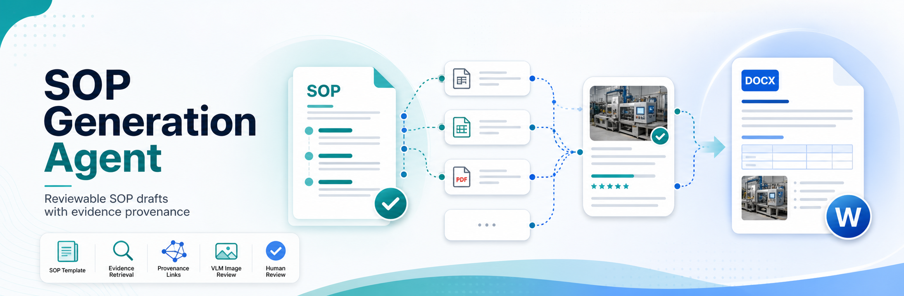

<p align="center">
  
</p>

# SOP Generation Agent

Reviewable SOP draft generator with staged human review, section-level evidence planning, paragraph provenance, VLM-assisted image evidence, and clean DOCX export.

## What It Does

SOP Generation Agent turns source documents, optional reference records, and a DOCX SOP template into a reviewable SOP draft.

- Parses source PDFs with OCR-first support and PyMuPDF text fallback.
- Parses reference files from PDF, Excel, CSV, Markdown, and TXT.
- Detects DOCX template sections with rules plus optional LLM refinement.
- Plans section-level source/reference evidence with dense embeddings, BM25, and RRF.
- Falls back to BM25 sparse retrieval when the embedding provider is unavailable.
- Uses an LLM to generate structured SOP section blocks, not raw concatenated text.
- Supports rich draft blocks: paragraphs, headings, bullets, numbered lists, tables, callouts, and images.
- Uses VLM-capable models to score PDF image crops for section relevance.
- Preserves paragraph/block-level provenance in reports while keeping the final DOCX clean.
- Stores all job artifacts locally under the configured job data directory.

## Quick Start

The default path is Docker Compose:

```bash
docker compose up
```

Open:

```text
http://localhost:7860
```

Compose builds one FastAPI image, builds the React/Vite frontend inside that image, mounts `./data/jobs` for job artifacts, mounts a model catalog into `/app/backend/models.json`, and mounts `./config` for tokenizer/domain dictionaries.

For real usage, create a local model catalog first:

```bash
cp backend/models.example.json backend/models.json
```

`backend/models.json` is intentionally git-ignored because it may contain local provider URLs, model IDs, or inline API keys. Without a local catalog, Compose falls back to `backend/models.example.json`.

To rebuild after config or dependency changes:

```bash
docker compose up --build
```

## Local Development

After dependencies are installed, one command builds the frontend and starts the combined FastAPI service:

```bash
make dev
```

Initial setup:

```bash
python -m venv .venv
. .venv/bin/activate
pip install -e ".[dev]"
npm --prefix frontend install --legacy-peer-deps
cp backend/models.example.json backend/models.json
make dev
```

`make dev` loads `.env` when present and defaults local artifacts to `./data/jobs`. If `.env` still contains the container default `SOP_DATA_ROOT=/data/jobs`, the dev script maps it to local `./data/jobs`.

## Workflow

1. Create a job with review settings and a selected generation model.
2. Upload source PDFs, optional reference files, and one DOCX template.
3. Analyze template sections and review the detected fill targets.
4. Approve template sections or apply feedback and re-refine them.
5. Review planned text and image evidence for each section.
6. Approve evidence or apply feedback and re-plan.
7. Generate structured section drafts.
8. Review paragraph/block provenance, regenerate sections if needed, and approve the draft.
9. Download `final_sop.docx` plus coverage, provenance, and debug reports.

Human-in-the-loop gates are enabled by default. If a gate is disabled, the backend records an explicit auto-approval decision and the UI still shows progress, logs, warnings, and generated artifacts.

## Model Catalog

Generation models are selected from an AgentPlayground-style `models.json`. Provider URLs and API keys are injected at service startup, not edited in the UI.

The tracked template is `backend/models.example.json`. Copy it to `backend/models.json` and edit the local file for your environment:

```bash
cp backend/models.example.json backend/models.json
```

Do not commit `backend/models.json`; it is ignored on purpose. Use `apiKeyEnv` whenever possible instead of storing secrets directly in JSON.

```json
{
  "providers": {
    "local": {
      "baseUrl": "http://host.docker.internal:11434/v1",
      "api": "openai-completions",
      "apiKeyEnv": "SOP_LLM_API_KEY",
      "models": [
        {
          "id": "qwen3:8b",
          "name": "Qwen3 8B",
          "contextWindow": 32768,
          "input": ["text"]
        },
        {
          "id": "vision-model",
          "name": "Vision SOP Writer",
          "contextWindow": 131072,
          "input": ["text", "image"]
        }
      ]
    }
  }
}
```

If a model declares `"image"` in `input`, the UI marks it as image-capable and the backend can use it as a VLM for PDF image evidence. If the selected model is text-only, image extraction and insertion are skipped.

## Runtime Configuration

Common settings:

| Variable              | Purpose                                                      | Default                  |
| --------------------- | ------------------------------------------------------------ | ------------------------ |
| `SOP_DATA_ROOT`     | Job storage root.                                            | `/data/jobs` in Docker |
| `SOP_FRONTEND_DIST` | Built frontend directory served by FastAPI.                  | `frontend/dist`        |
| `SOP_MODELS_PATH`   | Mounted model catalog path.                                  | `backend/models.json`  |
| `SOP_MODELS_HOST_PATH` | Docker Compose host-side model catalog path. | `./backend/models.example.json` unless `.env` overrides it |
| `SOP_LLM_API_KEY`   | Optional key referenced by `apiKeyEnv` in `models.json`. | `ollama` in Compose    |
| `SOP_CORS_ORIGINS`  | Comma-separated allowed origins.                             | `*`                    |

Job isolation and retention:

| Variable                             | Purpose                                                                 | Default           |
| ------------------------------------ | ----------------------------------------------------------------------- | ----------------- |
| `SOP_CLIENT_COOKIE_NAME`           | Anonymous browser owner cookie name.                                    | `sop_client_id` |
| `SOP_CLIENT_COOKIE_MAX_AGE_DAYS`   | Owner cookie lifetime. Empty follows job retention.                     | empty             |
| `SOP_CLIENT_COOKIE_SECURE`         | Use secure cookies for HTTPS deployments.                               | `false`         |
| `SOP_CLIENT_COOKIE_SAMESITE`       | Cookie SameSite policy:`lax`, `strict`, or `none`.                | `lax`           |
| `SOP_JOB_RETENTION_DAYS`           | Job artifact retention window.`0` disables TTL cleanup.               | `30`            |
| `SOP_JOB_CLEANUP_INTERVAL_SECONDS` | Background cleanup interval while service runs.`0` disables the loop. | `3600`          |

Queue and concurrency:

| Variable                         | Purpose                                             | Default                 |
| -------------------------------- | --------------------------------------------------- | ----------------------- |
| `SOP_QUEUE_REDIS_URL`          | Redis URL used by the web process and RQ worker.    | `redis://redis:6379/0` |
| `SOP_WORKER_QUEUES`            | Comma-separated RQ queues consumed by workers.      | `default`             |
| `SOP_WORKER_COUNT`             | RQ worker processes started by the worker service.  | `4`                   |
| `SOP_MAX_CONCURRENT_ANALYZE`   | Max concurrent analysis/evidence-planning tasks.    | `3`                   |
| `SOP_MAX_CONCURRENT_GENERATE`  | Max concurrent draft generation tasks.              | `2`                   |
| `SOP_MAX_CONCURRENT_OCR`       | Max concurrent OCR provider calls.                  | `2`                   |
| `SOP_MAX_CONCURRENT_EMBEDDING` | Max concurrent embedding provider calls.            | `4`                   |
| `SOP_MAX_CONCURRENT_LLM`       | Max concurrent text LLM calls.                      | `2`                   |
| `SOP_MAX_CONCURRENT_VLM`       | Max concurrent image/VLM calls.                     | `1`                   |

Provider settings:

| Variable                          | Purpose                                                                      |
| --------------------------------- | ---------------------------------------------------------------------------- |
| `SOP_EMBEDDING_API_URL`         | Embedding endpoint. Supports OpenAI-style embeddings or Ollama native shape. |
| `SOP_EMBEDDING_API_KEY`         | Embedding API key.                                                           |
| `SOP_EMBEDDING_MODEL`           | Embedding model id.                                                          |
| `SOP_EMBEDDING_TIMEOUT_SECONDS` | Embedding request timeout.                                                   |
| `SOP_OCR_API_BASE`              | OpenAI-compatible OCR/VLM chat completions base URL.                         |
| `SOP_OCR_API_KEY`               | OCR provider API key.                                                        |
| `SOP_OCR_MODEL`                 | OCR model id.                                                                |
| `SOP_OCR_TIMEOUT_SECONDS`       | OCR request timeout.                                                         |

Retrieval and chunking:

| Variable                          | Purpose                                                          | Default              |
| --------------------------------- | ---------------------------------------------------------------- | -------------------- |
| `SOP_CHUNK_SIZE`                | Source/reference chunk size in characters.                       | `900`              |
| `SOP_CHUNK_OVERLAP`             | Character overlap between chunks.                                | `120`              |
| `SOP_CHUNK_METHOD`              | `vanilla`, `contextual`, or `anthropic`.                   | `vanilla`          |
| `SOP_SECTION_DETECTION_MODE`    | `rules` or `rules_llm`.                                      | `rules_llm`        |
| `SOP_RETRIEVAL_MODE`            | `dense_sparse_rrf` or `sparse_only`.                         | `dense_sparse_rrf` |
| `SOP_RRF_K`                     | Reciprocal-rank-fusion constant.                                 | `60`               |
| `SOP_SOURCE_TOP_K`              | Max source candidates per section before threshold filtering.    | `6`                |
| `SOP_REFERENCE_TOP_K`           | Max reference candidates per section before threshold filtering. | `5`                |
| `SOP_REFERENCE_PREFILTER_LIMIT` | BM25 prefilter size for reference records.                       | `80`               |
| `SOP_SOURCE_SCORE_THRESHOLD`    | Minimum score for source candidates.                             | `0.08`             |
| `SOP_REFERENCE_SCORE_THRESHOLD` | Minimum score for reference candidates.                          | `0.05`             |

Tokenizer and domain terms:

| Variable                                 | Purpose                                                                       | Default                                |
| ---------------------------------------- | ----------------------------------------------------------------------------- | -------------------------------------- |
| `SOP_CJK_TOKENIZER`                    | `auto`, `ckiptagger`, `jieba`, or `regex`.                            | `auto`                               |
| `SOP_SCRIPT_NORMALIZATION`             | `dual`, `s2t`, `t2s`, or `none`.                                      | `dual`                               |
| `SOP_CKIPTAGGER_DATA_DIR`              | CKIPTagger model data directory. Required only when forcing CKIPTagger.       | empty                                  |
| `SOP_DOMAIN_DICT_PATH`                 | Permanent domain dictionary file.                                             | `/config/domain_terms.txt` in Docker |
| `SOP_CKIPTAGGER_DICT_MODE`             | `recommend` or `coerce`.                                                  | `recommend`                          |
| `SOP_JIEBA_DICT_PATH`                  | Jieba user dictionary file.                                                   | `/config/jieba_terms.txt` in Docker  |
| `SOP_DOMAIN_TOKEN_EXTRACTION`          | Preserve model names, part numbers, versions, and error codes as BM25 tokens. | `true`                               |
| `SOP_DOMAIN_TERM_LLM_ENABLED`          | Let the LLM suggest job-local temporary domain terms during analysis.         | `false`                              |
| `SOP_DOMAIN_TERM_CONFIDENCE_THRESHOLD` | Minimum confidence for temporary domain terms.                                | `0.75`                               |

Image evidence:

| Variable                              | Purpose                                                                                        | Default  |
| ------------------------------------- | ---------------------------------------------------------------------------------------------- | -------- |
| `SOP_IMAGE_RELEVANCE_THRESHOLD`     | Minimum VLM section relevance score for image candidates.                                      | `0.75` |
| `SOP_IMAGE_TOP_K_PER_SECTION`       | Max image candidates shown per section after scoring.                                          | `3`    |
| `SOP_IMAGE_MAX_INSERTS_PER_SECTION` | Max image blocks inserted into a section draft by default.                                     | `1`    |
| `SOP_IMAGE_MIN_WIDTH`               | Minimum extracted image crop width.                                                            | `120`  |
| `SOP_IMAGE_MIN_HEIGHT`              | Minimum extracted image crop height.                                                           | `80`   |
| `SOP_VLM_CROP_FALLBACK_ENABLED`     | Allow VLM-suggested crop from full page images when PDF image extraction finds no useful crop. | `true` |

## Retrieval Behavior

Text retrieval uses dense embeddings plus BM25 sparse retrieval with RRF fusion by default. If the embedding provider fails during a job, the system switches to BM25-only mode and records a visible degraded-mode warning in logs, reports, and the evidence plan.

Sparse retrieval uses `bm25s` with a script-aware tokenizer. `auto` uses regex/domain tokens for English-only text, Jieba for simplified or mixed CJK text, and CKIPTagger for traditional-heavy text when CKIPTagger data is configured. OpenCC shadow normalization lets simplified and traditional Chinese match each other without changing the original review text.

CKIPTagger is optional because its runtime/model footprint is larger. Install the `ckip` extra or bake it into a custom image before setting `SOP_CJK_TOKENIZER=ckiptagger` or `SOP_CKIPTAGGER_DATA_DIR`.

## VLM Image Evidence

Image support is opt-in through the selected model's catalog metadata:

```json
{ "id": "vision-model", "input": ["text", "image"] }
```

When a VLM-capable generation model is selected:

1. Source/reference PDFs are scanned with PyMuPDF.
2. Real PDF image regions are cropped and saved under the job's intermediate artifacts.
3. The selected VLM scores each image against the SOP section title and text evidence.
4. High-relevance image candidates appear in Evidence Review.
5. Recommended image blocks appear in Draft Review and can be approved with the draft.
6. Final DOCX contains clean figures/captions, while reports retain image paths, page, bbox, score, and reasoning.

The MVP supports source/reference PDF images. It does not yet extract embedded Excel images, DOCX template images, or user-uploaded standalone image files.

## Artifacts

Each job is stored under:

```text
{SOP_DATA_ROOT}/{job_id}
```

Important outputs:

| Artifact                                          | Purpose                                                    |
| ------------------------------------------------- | ---------------------------------------------------------- |
| `intermediate/template_section_resolution.json` | Detected and refined template sections.                    |
| `intermediate/evidence_plan.json`               | Planned source, reference, and image evidence per section. |
| `intermediate/generated_sections.json`          | Structured section draft blocks.                           |
| `outputs/final_sop.docx`                        | Clean final SOP document.                                  |
| `outputs/coverage_report.json`                  | Evidence mapping and usage coverage.                       |
| `outputs/provenance_report.json`                | Paragraph/block-level evidence provenance.                 |
| `outputs/debug_report.json`                     | Status, logs, artifact list, warnings, and errors.         |

## Startup Preflight

The service fails fast when critical runtime configuration is invalid. Preflight checks include writable storage, built frontend presence, valid non-empty `models.json`, provider base URL/API key settings, embedding settings when dense retrieval is enabled, tokenizer dependencies, dictionary paths, CKIPTagger model data, cookie settings, CORS settings, and image relevance threshold bounds.

OCR is optional because PDF text/PyMuPDF fallback exists, but partial OCR config is rejected.

## Verification

Frontend build:

```bash
npm --prefix frontend run build
```

Python tests:

```bash
python -m pytest
```

Syntax check:

```bash
python -m compileall backend/app tests
```

Whitespace check:

```bash
git diff --check
```

## Current Limits

- DOCX insertion anchors are safest for normal Word body paragraphs. Header/footer text, textboxes, floating shapes, and headings inside table cells are not treated as first-class insertion anchors yet.
- The final DOCX renderer handles common rich blocks, but deeply nested Word styling and arbitrary template layout preservation remain best-effort.
- VLM image evidence depends on the selected model supporting OpenAI-compatible image input.
- Job isolation is anonymous browser-cookie isolation, not account-based authentication.
